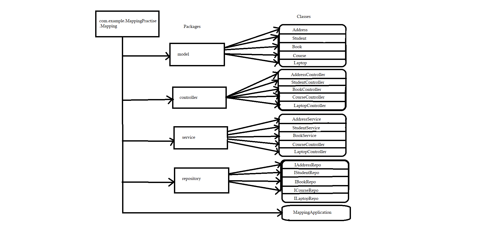

## Frameworks and language used 
* SpringBoot Framework and java language.
## Data Flow

## DataBase Design

## Data Structure used in your project
* Arraylist
## Project Summary

This is the "Practice Mapping Application" which following the mvc-Architecture.In this application, I have created a package of Mapping_Practise_Mapping within this package I have created Four more packages to define layer as given in DFD. This project has Four Model Address,Student,Courses,Laptop And Books which giving the relation between them. Every Student has unique address so we are performing one-to-one Mapping over here And So the User is our reference side and Address is our owning side. On the other hand, multiple Books can be refered by single Student ,multiple Students can able to access multiple multiple courses And multiple courses can be access by multiple Students so that's ,we are performing many-to-many mapping on it.And storing the data in mySQL using the dependency MYSQL Driver And JPA.For posing the data, we are performing crud operations on it with the help of endpoints like @GetMapping to get all the information of the Model, @PostMapping to create a Model Information using the attributes, @deleteMapping to remove a Model related Information from list by giving specific Model Id .That's the whole project meant. 